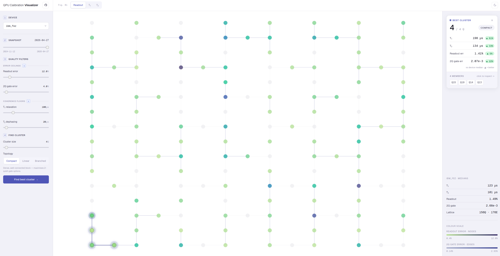

# QPU Calibration Visualizer

[](https://github.com/nebmit/qpu/actions/workflows/ci-cd.yml)

An interactive SvelteKit single-page app that loads time-series calibration data for
IBM heavy-hex QPUs and renders an interactive 156-qubit lattice. Its core feature is a
**cluster finder**: given filter cutoffs (readout/CX error, T₁/T₂) and a target size +
topology, it greedily grows the best-quality connected qubit cluster.

🔗 **Live:** <https://qpu.timben.net>



## Quick start (Docker)

```sh
docker build -t qpu .
docker run -p 3000:3000 qpu
# open http://localhost:3000
```

Or pull the published image (built and pushed by CI on `main`):

```sh
docker run -p 3000:3000 ghcr.io/nebmit/qpu:latest
```

## Local development

Requires **Node.js ≥ 24** (enforced via `engine-strict`).

```sh
npm ci
npm run dev        # add -- --open to open a browser tab
# open http://localhost:5173
```

## Testing

Unit tests live next to the domain logic they cover (`src/lib/**/*.test.ts`) and run on
Vitest:

```sh
npm test
```

The pure domain layer (cluster finder, metrics, snapshot adaptation, URL serialization,
statistics) is covered directly; presentation stays thin and formatting-only.

## Data

Bundled calibration snapshots derived from the IBM Qiskit Runtime REST API. The app loads
static `dataset.json` and `positions.json` from `static/` at runtime — there is no live
backend or database.
